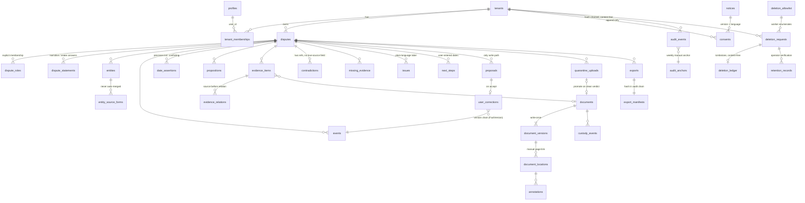

# NYAYOS FM-A FOUNDATION GAP REPORT (A-030, Phases 5–6)

| Field | Value |
|---|---|
| Assignment | A-030 — Canonical Repository Integration and FM-A Foundation Build |
| Branch | `feature/fma-foundation-v1` (from `main` `6c6b478`) — **not merged**; REVIEW |
| Gate | FA-001 staging only. No deployment · no production change · no direct `main` commit · no legal functionality · no AI functionality · no advocate marketplace |
| Governing spec | FM-A Scope Sheet V1 (§4 data, §5 API, §6 UI, §7 security, §8 tests, §9 exit gate); Security & Data Architecture Spec V1 |
| Date | 23 September 2026 |
| Continuity owner | M365 Copilot |

**Reading guide.** READY = exists and conforms on this branch · PARTIAL = something usable exists but the FM-A requirement is not met · MISSING = nothing exists. "Domain" means `app/src/domain/`; "SQL" means `db/migrations/0001_fma_foundation.sql` (specification-grade; see §8 for what was and was not executed). Nothing here claims security or compliance.

---

## 1. What was built on this branch (VERIFIED)

| Layer | Artefact | Size | Verification |
|---|---|---|---|
| Specifications | 6 Markdown specs + 2 deck text extracts imported unchanged | — | SHA-256 recorded in registry (A-010, A-031) |
| Domain (TypeScript) | `app/src/domain/` — enums, tables, config, context, authz, consent, identity, dispute, proposal, evidence, audit, export, deletion, copy, index | 14 modules | `tsc` clean · `eslint` 0 errors · 79 tests in `app/tests/domain/` (suite 132/132) |
| Schema (SQL) | `db/migrations/0001_fma_foundation.sql` | 39 tables, 39 enums/types, 4 helpers, 6 server functions, 8 triggers, 60+ policies, allow-list seed, self-check | `scripts/db/schema-lint.mjs` clean · applied cleanly to an ephemeral local PostgreSQL 16.14 container (synthetic data, removed afterwards); `db/tests/smoke_0001.sql` 41/41 checks PASS |
| CI | `.github/workflows/schema-lint.yml` | — | Runs the lint on PRs touching `db/**`; not yet a required check |
| Documents | Repository assessment (Phase 1); this gap report (Phases 5–6) | — | — |

## 2. Entity model (Phase 4)

### 2.1 Assignment vocabulary → canonical tables

| Assignment entity | Canonical table(s) (Scope Sheet §4) | Domain type | Note |
|---|---|---|---|
| Tenant | `tenants`, `tenant_memberships` | `Tenant`, `TenantMembership` | Personal only in FM-A; `type` immutable (trigger) |
| User | `profiles`, `platform_roles`, session (provider-managed) | `Profile`, `PlatformRoleRow`, `Session` | No roles on profile rows |
| Matter | `disputes`, `dispute_roles`, `dispute_statements`, `intake_questions` | `Dispute` (alias `Matter`) | `tenant_id` immutable; plain-language category label only |
| Evidence | `quarantine_uploads`, `documents`, `document_versions`, `document_locations`, `annotations`, `custody_events`, `jobs`, `evidence_items`, `evidence_relations` | `QuarantineUpload`, `Document`, `DocumentVersion`, … | Write-once versions; manual locations |
| Fact | `entities`, `entity_source_forms`, `events`, `date_assertions`, `propositions`, `contradictions`, `missing_evidence`, `issues`, `next_steps` | `CanonicalItem` union with the `Provenance` contract | Single-writer; no direct UPDATE grant |
| FactVersion | derived from `user_corrections` | `FactVersion` via `buildVersionChain()` | No `fact_versions` table (CR-1); chain = corrections ordered by `resulting_version` |
| Proposal | `proposals`, `user_corrections` | `Proposal`, `UserCorrection` | Origin `user` only enabled; `ai`/`reviewer` declared inert |
| AuditEvent | `audit_events`, `audit_anchors` | `AuditEvent`, `AuditAnchor` | Hash-chained; content-free; append-only |
| ExportManifest | `exports`, `export_manifests` | `ExportRecord`, `ExportManifest` | Omissions listed for incomplete provenance |
| DeletionTombstone | `deletion_ledger` (+ `deletion_requests`, `retention_records`) | `DeletionLedgerEntry` (alias `DeletionTombstone`) | Content-free (OL-03 interim); never deleted |
| Configuration | `config_provisional`, `deletion_allowlist`, `notices`, `consents` | `ProvConfig`, `DELETION_ALLOWLIST`, `Notice`, `Consent` | [PROV] values are configuration, not constants |

### 2.2 Entity diagram

Not created in FM-A (CR-1): `document_derivatives`, `document_chunks`, `share_versions`, `share_items`, `grants`, `reviewer_comments`, `ai_runs`, `legal_holds`, `break_glass_requests`, `drafts`, `draft_versions`, authority schema, `fact_versions`. The schema lint fails if any of them appears.

## 3. Security coverage matrix S1–S16 (Phase 6)

### 3.1 Numbering reconciliation

The FM-A Scope Sheet / Fast Mode Strategy §7 and the Executive Architecture Deck slide 16 both define "S1–S16" but with different contents. **The Scope Sheet numbering is canonical** (it maps to the SEC test IDs and the exit gate). The deck's controls are all present in the Scope Sheet under other numbers:

| Deck slide 16 | Content | Scope Sheet equivalent |
|---|---|---|
| D-S1 Authentication & session binding | — | S1 (context), S13; F01 |
| D-S2 Tenant resolution & immutability | — | S1 |
| D-S3 Role & matter membership checks | — | S1 (`is_dispute_member`) |
| D-S4 Single-writer enforcement | — | S3 |
| D-S5 Deny-by-default authorization | — | S2 |
| D-S6 Secret & key management | — | S13 |
| D-S7 Row-level security policies | — | S1 |
| D-S8 Upload grant scoping | — | S5, S6 (A09) |
| D-S9 Quarantine isolation | — | S5 |
| D-S10 Provenance completeness | — | S3 (CR-8), export G4 |
| D-S11 Version immutability | — | S3, S5 |
| D-S12 Export manifest integrity | — | S5/S7 (F16) |
| D-S13 Transport & at-rest encryption | — | S14/S16 (provider) |
| D-S14 Append-only hash-chained audit | — | S7 |
| D-S15 Reference-checked deletion | — | S9 (+ `document_reference_policy` [PROV]) |
| D-S16 Tombstone retention | — | S9 (content-free per OL-03 interim) |

### 3.2 Coverage (Scope Sheet numbering)

| S | Control | Domain (TS) | SQL migration | Tests on branch | Status on branch | What remains (wave) |
|---|---|---|---|---|---|---|
| S1 | Tenant and dispute isolation | `isDisputeMember`, `authorize` (tenant boundary first), server-built `RequestContext` | RLS enabled + forced on 39 tables; `is_dispute_member`, `is_tenant_member`; `tenant_id` immutable trigger; no client tenant id | authz role matrix (11); live: cross-tenant reads return zero rows, cross-tenant propose denied, anonymous denied (SEC-TEN-01/02/04 pattern, 8 checks) | **PARTIAL** — model and policies exist; no live staging database, no CI schema lint against a live DB yet | W1: apply on staging, SEC-RLS-01…04, SEC-TEN-01…04 as CI |
| S2 | Deny-by-default; no standing operator content access | `authorize` denies unresolved requirements; `platform_security` has no content path | No policy grants content to any platform role; no break-glass or support tables | authz (platform role test) | **PARTIAL** — enforced in model; operator statement copy present (U02/U21) | W1 notices; W4 U21 |
| S3 | Single-writer canonical facts | `proposeChange`/`decideProposal`/`ownerChange`; no update export; `buildVersionChain`; `reconcileHistory` | No INSERT/UPDATE/DELETE grant to authenticated on §4.3 tables; `propose_change`/`decide_proposal` security definer; `user_corrections` append-only trigger; origin CHECK `user` | proposal (10); enums; live: create → version 1 with null previous value; update → version 2 with previous text; direct INSERT/UPDATE denied; double decide refused; ai origin blocked (9 checks) | **READY (foundation)** | W2 wiring to Fact Card |
| S4 | Frozen share snapshots | `grantAllows` always false; grant enums declared | `grant_allows` returns false; no share tables | authz (6 permissions × 4 principals) | **READY (seam)** — no live-share path exists | FM-B |
| S5 | Write-once originals | `transitionUpload` (promote only from `clean`; unavailable stays quarantined); `sniffMime`; `acceptUpload`; `replaceDocument`; `assertVersionImmutable`; `sha256Hex` | `document_versions` clean-only CHECK, no UPDATE/DELETE, forbid trigger; `quarantine_uploads`; custody events | evidence (13) | **PARTIAL** — model complete; no storage bucket, scan adapter or A09–A15 functions | W3 (FD-03 scan provider) |
| S6 | Private buckets; authorised signed URLs; short TTL | `signedUrlTtlSeconds` [PROV 300 s / 120 s]; `storagePathFor` | Path convention `<tenant>/<dispute>/<doc>/<version>`; no bucket DDL (provider) | config | **MISSING (infrastructure)** — design only | W1/W3 |
| S7 | Append-only hash-chained audit; no content in logs | `appendAuditEvent` (audit_writer only), `computeRowHash`, `verifyAuditChain`, `assertContentFree` allow-list, `myActivity` | `log_audit_event` (service only), before-insert trigger (catalogue form, allow-listed keys, hash), forbid update/delete triggers, no grants; `verify_audit_chain()` | audit (6); live: chain linked from genesis, verifies intact, content key refused, UPDATE denied even to superuser by trigger, tamper at seq 2 detected (8 checks) | **READY (foundation)** — weekly manual anchor is a procedure, not code | W1 operational log redaction filter |
| S8 | Consent enforced; analytics/training locked off | `requirePurpose`, `assertGrantable`; `LOCKED_PURPOSES`; `resolveFeatureFlags` refuses locked flags | `consents.purpose` CHECK excludes locked purposes; insert policy limits to `storage`,`export`; append-only | consent (6); enums | **READY (foundation)** | W1 `requirePurpose` in every server function |
| S9 | Deletion that deletes; honest status | `transitionDeletion` state machine, `deletionStatus` (never "complete" while incomplete), `referenceCheck`, `tablesForScope`, `allowlistCovers`, content-free `DeletionLedgerEntry` | `deletion_requests`, `deletion_ledger` (forbid trigger), `retention_records`, `deletion_allowlist` seeded for 39 tables; migration self-check | export-deletion (4); enums (allow-list) | **PARTIAL** — model complete; no worker, no scripted verification procedure yet | W4; FM-E automation |
| S10 | Separate corpora | `NOT_CREATED_IN_FMA` includes authority tables | No authority schema | schema-lint | **READY** (by absence) | BB2 M3 |
| S11 | Zero-tool AI | `FMA_ENABLED_PROPOSAL_ORIGINS = [user]`; ai origin refused; no model call anywhere | `proposals.origin` CHECK `user`; no ai tables | proposal (ai origin inert); code review: no AI dependency | **READY** (by absence) | FM-D |
| S12 | Environment separation | — | — | Fixture data is synthetic (A-025/A-026 reviews); smoke data synthetic | **PARTIAL** — no environments exist yet | W1 env policy (BB2 §3.1) |
| S13 | Secrets server-side only | Domain has no secrets; `Session` carries no token material | Service roles NOLOGIN NOBYPASSRLS | — | **PARTIAL** — bundle secret scan not in CI | W1 SEC-SEC-01 in `dependency-check` |
| S14 | India-region hosting | — | — | — | **MISSING** — FD-02 undecided | Founder decision FD-02 |
| S15 | No send/sign/file/approve; no marketplace or fee paths | No such functions, enums or copy; `PROHIBITED_TERMS` guard | No such tables or functions | copy guard test | **READY** (by absence) | Copy review FN-16 each wave |
| S16 | Encrypted backups; one rehearsed restore | `backup_rotation_days` [PROV 35] surfaced in deletion status | — | — | **MISSING** — no database | W1 provider config; W5 drill |

**Summary:** READY (foundation or by absence) 8 · PARTIAL 6 · MISSING 3 (S6, S14, S16 are infrastructure that cannot exist before FD-02). No control is contradicted by anything on the branch.

## 4. UI coverage matrix U01–U21 (Phase 5)

The Figma FM-A source handoff package was **not supplied and does not exist locally**, so no FM-A screen was imported. Coverage is judged against the existing 17 components and the new domain layer.

| U | Screen | Existing component(s) | Domain support | Status | Gap to FM-A |
|---|---|---|---|---|---|
| U01 | Sign-up / sign-in / OTP | `InputField`, `Button`, `NotificationBanner` | `Session`, `createPersonalTenantOnSignUp`, `otp_max_attempts` [PROV] | **MISSING** | No auth screen, no provider, no rate-limit state, no language switch component |
| U02 | Consent notice | `NotificationBanner` | `Consent`, `Notice`, `REQUIRED_COPY.consent_no_ai`, `operator_access` | **MISSING** | No screen; copy exists hi/en |
| U03 | Dashboard | `AppShell`, `ReadinessIndicator` | `Dispute` | **PARTIAL** | Shell exists; no dispute list, no "Start a dispute" |
| U04 | New dispute — "What happened?" | `InputField` | `Dispute`, `DisputeStatement`, `REQUIRED_COPY.what_happened_*` | **MISSING** | No screen; headline/help copy ready |
| U05 | Intake | — | `IntakeQuestion`, `nextQuestion`, `DONT_KNOW`, `BranchRule` | **MISSING** | No screen; deterministic engine ready; question set awaits FM-0 learnings |
| U06 | Evidence locker | `EvidenceCard`, `EvidenceWorkspace` (A-023/A-025) | `QuarantineUpload`, `Document`, `UPLOAD_STATES`, `acceptUpload` | **PARTIAL** | Lifecycle enum differs (§ assessment C5); no page count / verification state; no real upload |
| U07 | Document viewer | — | `DocumentVersion`, `DocumentLocation`, `REQUIRED_COPY.mark_source_page` | **MISSING** | No viewer, no page navigation, no link-a-fact mode |
| U08 | Fact list / confirmation | `FactCard`, `SourcePanel`, `StatusChip`, `ConfidenceBand`, `InlineCorrectionInput` (A-020/A-022) | `CanonicalItem`, `Provenance`, `ownerChange`, `VERIFICATION_STATUSES` | **PARTIAL** | Card conforms (A-021 review); not wired to proposals; list screen absent |
| U09 | Timeline | `TimelineEventCard`, `PartiesTimelineWorkspace` (A-026) | `Event`, `DateAssertion`, `markConflictingDates` | **PARTIAL** | Renders all five precisions; not wired; no conformance review yet |
| U10 | Parties | `PartyCard`, `PartiesTimelineWorkspace` | `Entity`, `EntitySourceForm`, `REQUIRED_COPY.no_auto_merge` | **PARTIAL** | No duplicate-review screen; source forms not shown |
| U11 | Evidence map | `SourceBadge` | `EvidenceRelationRow`, `validateEvidenceRelation` | **MISSING** | No screen |
| U12 | Information to review (contradictions) | `DateBadge` (conflict), `SourcePanel` | `Contradiction`, `validateContradiction`, `REQUIRED_COPY.contradiction_neutral` | **MISSING** | No screen; A-021 items 4 (contradiction actions) still open |
| U13 | What may still be useful (gaps) | — | `MissingEvidence` | **MISSING** | No screen |
| U14 | File label (issue) | — | `Issue`, `REQUIRED_COPY.issue_label_disclaimer` | **MISSING** | No screen |
| U15 | Next steps | — | `NextStep` (`userSetDate`), `REQUIRED_COPY.next_step_date_label` | **MISSING** | No screen |
| U16 | Export preview / privacy check | — | `EXPORT_SECTIONS`, `buildExportManifest` (omissions) | **MISSING** | No screen |
| U17 | Export result | — | `ExportManifest`, `NO_AI_STATEMENT_*`, `INTEGRITY_SCOPE_STATEMENT_*` [PROV OL-08] | **MISSING** | No screen; statements ready hi/en |
| U18 | Delete flows | — | `DeletionRequest`, `deletionStatus`, `REQUIRED_COPY.deletion_*` | **MISSING** | No screen; honest-status model ready |
| U19 | My activity | — | `myActivity` | **MISSING** | No screen |
| U20 | Account and language settings; MFA enrolment | — | `Profile.preferredLanguage`, `Session.mfaVerified` | **MISSING** | No screen; no provider |
| U21 | Trust & safety page | — | `REQUIRED_COPY.trust_ai_assists`, `operator_access` | **MISSING** | Static page not built; copy ready |

**Summary:** READY 0 · PARTIAL 5 (U03, U06, U08, U09, U10) · MISSING 16. Every screen has its domain types and required copy in place; what is missing is the design input and the route/screen layer (wave W2 onward).

## 5. API coverage A01–A28 (reference)

| Group | Functions | Domain | SQL | Status |
|---|---|---|---|---|
| Auth / identity | A01 | `createPersonalTenantOnSignUp`, `revokeSession` | `sign_up_personal_tenant` | PARTIAL (no provider) |
| Consent | A02 | `requirePurpose`, `withdrawConsent` | policies + CHECK | PARTIAL (no function wrapper) |
| Dispute core | A03–A08 | `Dispute`, `nextQuestion`, `proposeChange`, `decideProposal`, `ownerChange` | `create_dispute`, `propose_change`, `decide_proposal` | PARTIAL (A04 addStatement, A08 getDisputeFile not written) |
| Evidence | A09–A18 | state machine, `acceptUpload`, `replaceDocument`, `validateContradiction` | tables + grants for service roles | MISSING functions |
| Export | A19–A22 | `buildExportManifest`, `verifyManifestAgainstStored` | tables | MISSING functions |
| Deletion | A23–A26 | `transitionDeletion`, `deletionStatus`, `tablesForScope` | tables + policies | MISSING worker |
| Activity / audit | A27, A28 | `myActivity`, `appendAuditEvent` | owner-filtered policy, `log_audit_event` | READY (A28 foundation) / PARTIAL (A27 view) |

## 6. Technical risks

| # | Risk | Likelihood | Impact | Mitigation on branch | Owner / wave |
|---|---|---|---|---|---|
| R1 | Design drift: screens built without the Figma package diverge from the eventual design | High | Medium | No screens built; copy and types fixed first; A-008 tracked | Founder (supply package or decide to proceed from canonical copy) |
| R2 | SQL twin diverges from TypeScript twin as waves add columns | Medium | High | `schema-lint.mjs` enforces table parity; extend to columns in W1 | W1 |
| R3 | Migration behaves differently on the chosen provider (Supabase vs plain Postgres) | Medium | Medium | Provider-neutral context function with JWT fallback; the migration was executed once on plain PostgreSQL 16.14 (local ephemeral container), not on a provider | W1 (FD-02) |
| R4 | Dynamic SQL in `decide_proposal` (generic over 12 tables) hides a per-table edge case | Medium | High | Unknown/server-controlled keys refused; append-only types refuse updates; per-table tests owed | W1 tests SEC-MUT-02/03 per target type |
| R5 | Hindi copy is a working translation | High | Low–Medium | Marked [PROV translation]; native review before user exposure | W2 |
| R6 | Notice / integrity wording changes after counsel (OL-01, OL-04, OL-08) | High | Low | Text in constants and `notices` rows, not in logic | Counsel; W4 |
| R7 | Deck vs Scope Sheet disagreements resurface (S numbering, reference-checked deletion, tombstone hash) | Medium | Low | Recorded here §3.1 and assessment §4; `document_reference_policy` [PROV] | Founder decision before W3 |
| R8 | Audit hash canonicalisation differs between TS and SQL (both compute `sha256(prev ‖ canonical_row)` but serialise independently) | Medium | Medium | Same field order and separator; **cross-check test owed** before W1 relies on either verifier | W1 |
| R9 | `bun.lock` vs npm resolution drift (pre-existing) | Low | Low | No new dependencies added by this branch | — |
| R10 | Docker-based local verification is not CI | Medium | Medium | Recorded as a one-off; W1 adds a Postgres service container to CI running the smoke suite | W1 |

## 7. Estimated implementation waves

| Wave | Scope | Depends on | Exit evidence |
|---|---|---|---|
| **W0 — this branch** | Specs, domain layer, SQL migration (not applied), lint, reports | — | 132 tests · lint · schema-lint · this report |
| **W1 — Foundation live (M0-lite)** | Staging Postgres (synthetic, India region), apply `0001`, auth provider adapter, A01/A02/A28 server functions, `requirePurpose` middleware, CI Postgres service running the smoke suite + SEC-RLS-01…04, SEC-TEN-01…04, SEC-HASH-05, SEC-DEL-06, SEC-SEC-01 bundle scan | Founder merge of W0; **FD-02**; FD-01 confirmed | AC-M0-01…04, 06, 08 green on staging |
| **W2 — Dispute core screens (M1)** | Routes U01–U05, U08–U10 wired to domain and A03–A08; deterministic intake rules from FM-0; Fact Card ↔ proposals; FN-01, FN-02, FN-06, FN-07 | W1; Figma package or founder decision | AC-M1-01…07, 09 |
| **W3 — Evidence (M2-lite)** | Buckets, A09–A18, scan adapter (stub → provider), viewer U06/U07, manual locations, U11–U13; SEC-HASH-01…03, SEC-UPL-01…04, SEC-URL-01 | W1; **FD-03**; `document_reference_policy` decision | AC-M2-01…03, 06…09 |
| **W4 — Export and deletion (M5-lite, M6-skeleton)** | A19–A26, U14–U21, scripted deletion verification procedure, weekly anchor procedure; FN-10…FN-13, FN-15, FN-16; SEC-DEL-01/03/07, SEC-LANG-* | W2, W3 | AC-M5-01/02/04/05, AC-M6-04/07 |
| **W5 — FM-A exit gate** | FN-14 mobile end-to-end by two non-builders, restore drill, gate report per Scope Sheet §9 | W4; CB1 posture §9.4 | Scope Sheet §9.1–9.3 |

Effort is not estimated in days: the Scope Sheet forbids implementation claims and the two founder dependencies (FD-02, Figma package) dominate the schedule.

## 8. Verification record for this branch (VERIFIED)

| Check | Result |
|---|---|
| `npm run typecheck` | clean |
| `npx eslint src/domain tests/domain` | 0 errors |
| `npx vitest run` | 132 passed (79 new in `tests/domain/`) |
| `node scripts/db/schema-lint.mjs` | clean — 39 tables in SQL = 39 in `tables.ts`; 14 deferred names absent |
| Live execution of `0001_fma_foundation.sql` | **Executed once, locally, on an ephemeral `postgres:16-alpine` Docker container with synthetic data only.** Applied with `ON_ERROR_STOP` — exit 0. `db/tests/smoke_0001.sql` — **41/41 PASS** (sign-up, dispute creation, single-writer create/update/reject paths, direct-write denials, locked/reserved consent purposes, cross-tenant and anonymous isolation, audit chain link/verify/tamper/content-key/role checks, tenant type immutability, 39 tables forced RLS, 39 allow-list rows, no authenticated write grant on canonical tables). Three defects were found by execution and fixed before commit: `jsonb_populate_record` bypassing column defaults in `decide_proposal`; `is_service()` unusable inside a SECURITY DEFINER audit writer; `digest()` unreachable under the pinned `search_path` (replaced by core `sha256()`). The static lint caught none of them — see risk R10 |
| Deployment / staging / production | **None.** No environment was created or changed. The container above was local, held synthetic data only and was removed after the run |

## 9. Next implementation recommendation

1. **Founder:** review and merge `feature/fma-foundation-v1` by pull request (A-030 → CANONICAL on merge); decide **FD-02** (hosting/region) and confirm the Scope Sheet numbering, `document_reference_policy = block`, and the content-free tombstone as decisions (D-031…D-033 candidates).
2. **Then W1** as the single next build assignment: staging database with `0001` applied, auth adapter, A01/A02/A28, `requirePurpose` middleware, and the smoke suite promoted into CI with a Postgres service container.
3. **In parallel, non-blocking:** locate or re-export the Figma FM-A package (A-008) so W2 can start from the design rather than from canonical copy alone; native-speaker review of the Hindi strings in `copy.ts`.
