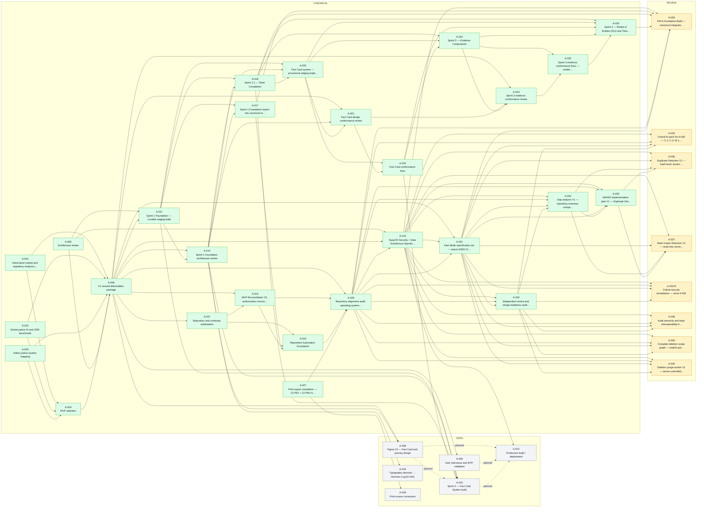

<!-- AUTO-GENERATED by scripts/governance/registry.mjs from NYAYOS_STATUS_REGISTRY.json. DO NOT EDIT BY HAND. Edit the registry JSON and run: node scripts/governance/registry.mjs generate -->
# NYAYOS DEPENDENCY GRAPH

**Source:** [`NYAYOS_STATUS_REGISTRY.json`](NYAYOS_STATUS_REGISTRY.json) · **Generated:** 2026-09-24 · **Tasks:** 41 · **Canonical:** 27

Solid arrows are **inputs** — always CANONICAL, enforced. Dashed arrows are **planned inputs** — dependencies that are not yet canonical; a task carrying any dashed arrow **may not leave OPEN**.



## Blocked tasks — waiting on non-canonical inputs

| Task | Waiting on | Those tasks are |
|---|---|---|
| **A-012** Production build / deployment | A-008, A-009, A-015 | A-008 (OPEN), A-009 (OPEN), A-015 (OPEN) |
| **A-015** Sprint 2 — Fact Card System build | A-008 | A-008 (OPEN) |

## Critical path to production

```
A-018 Sprint 1.1 State Completion  ─►  A-015 Sprint 2 Fact Cards  ─┐
A-008 Figma V2                      ────────────────────────────────┤
A-009 User interviews + WTP        ────────────────────────────────┼─►  A-012 Production (FA-002)
A-010 Security + data review       ────────────────────────────────┘
```

Production (A-012) has **no canonical inputs yet**; every arrow into it is dashed. That is the graph saying what the Founder Authorization Record says: FA-002 is not grantable today.
